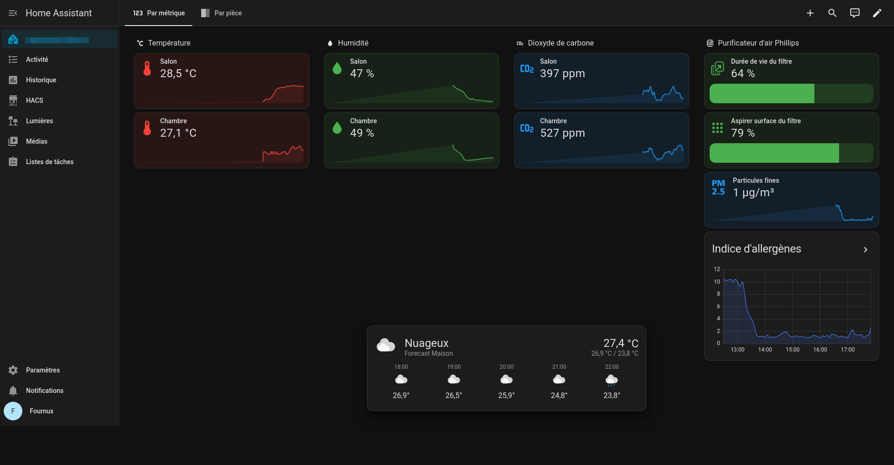

<h1 align="center">Rocky Setup</h1>

  <strong>
    My personal Rocky Linux server setup, automated with Ansible.
  </strong>

  
  
  
  
  

  

## Purpose

This home server acts as the core infrastructure for home automation and self-hosted services.

- **Home Assistant OS** in KVM/libvirt for smart home automation.
- **WireGuard VPN** server for secure remote access (`57100/udp`).

## Ansible Vault password

> `vault_password_file` is intentionally omitted from `ansible.cfg`; `bootstrap.sh` supplies it only for `run` and `check`, so lint and CI do not depend on a local secret.

## Requirements

- Fresh Rocky Linux 10.x host
- Regular user in `wheel` (Sudoer)
- Wired network interface named `enp3s0`

If your interface name differs, update `lan_interface` and `lan_connection` in `group_vars/all/main.yml`.

## Access

- **Cockpit Web Console**: `https://rocky-server.local:9090`
- **Home Assistant**: `http://homeassistant.local`
- **WireGuard VPN**: `57100/udp` (tunnel subnet `10.10.0.0/24`)
